# crashfuzz

An application-level crash-consistency checker. It records a target database's syscall
trace, enumerates the on-disk states a crash could legally leave behind, replays each one
through the target's own recovery path, and checks whether the durability the target
promised actually held.

> **Status: resolved.** Phases 0–4 and 6 complete; Phase 5 has one box deliberately unmet
> (not filed — see below). Primary target: [redb](https://github.com/cberner/redb). Control:
> SQLite. 10,942 crash states tested; one real bug found — permanent data loss, verified on
> 3.1.3 and 4.1.0, fixed upstream and released in 4.2.0 (2026-08-17), which recovers the
> length-corrected image with every acknowledged value intact. See [Results](#results) and
> [Findings](#findings).
>
> Plan: [`docs/EXECUTION-PLAN.md`](docs/EXECUTION-PLAN.md) · Spec: [`CLAUDE.md`](CLAUDE.md)

## Why

> CrashMonkey tests file systems and does not reorder I/O. ALICE tests applications and
> reorders I/O, but its target set is from 2014 and it needs a hand-written checker per
> workload. Pathfinder tests applications and scales further than both, on LevelDB, RocksDB
> and WiredTiger. crashfuzz applies ALICE's reordering model, under B3's empirical bound, to
> a storage engine none of them tested — redb — with the oracle derived mechanically from
> the engine's own written durability guarantee rather than hand-written per workload.

The bound is two of Mohan et al.'s (OSDI '18) empirical findings: 24 of 26 known crash-
consistency bugs reproduce within three or fewer operations, and every reported bug resulted
from a crash after an `fsync`-family call. See [`docs/prior-art.md`](docs/prior-art.md) for
the full comparison against all five readings this project is built on, and
[`docs/model.md`](docs/model.md)
for what "legal" means here and why.

## Requirements

Linux. `LD_PRELOAD`, ext4/xfs/btrfs, and loopback block devices are all required, so macOS
and Windows cannot host a run. On macOS, use the provided VM:

```bash
brew install lima
bun run vm:up      # Ubuntu 24.04 with ext4/xfs/btrfs and the toolchain
bun run vm:sh
bun run test:vm    # full suite, inside the VM's filesystem semantics
```

crashfuzz creates, mounts, and destroys real filesystems on loopback images under
`/var/lib/crashfuzz` on the guest disk. It never touches the host filesystem or the repo
mount. Do not point it at anything else.

## Architecture

```mermaid
flowchart LR
    subgraph capture["Phase 1 — Trace capture"]
        target["target workload\n(redb / SQLite)"]
        shim["LD_PRELOAD shim\n(shim/src/shim.c)"]
        trace["trace-<pid>.jsonl\n+ CAS payload store"]
        target -- "intercepted syscalls" --> shim --> trace
    end

    subgraph enumerate["Phase 2 — Crash state enumeration"]
        pgraph["persistence graph\n(happens-before edges\nper filesystem model)"]
        crashpts["crash points\n(fsync-adjacent + seeded sample)"]
        states["legal crash states\n(bounded subsets, torn writes)"]
        trace --> pgraph
        pgraph --> crashpts --> states
    end

    subgraph materialize["Materialization"]
        image["real loopback filesystem\n(ext4 / xfs / btrfs)"]
        states --> image
    end

    subgraph oracle["Phase 3 — Recovery and the oracle"]
        recover["target's own recovery\n(Database::open)"]
        acklog["acknowledgement log\n(marker channel)"]
        verdict["violation classes:\nLOST_ACKED / CORRUPT_INVARIANT\nRECOVERY_FAILED / PHANTOM_UNACKED"]
        image --> recover
        acklog --> verdict
        recover --> verdict
    end

    subgraph triage["Dedup + triage"]
        sig["root-cause signature\n(earliest dropped dependency)"]
        finding["packaged reproducer\n(image + trace prefix + run.sh)"]
        verdict --> sig --> finding
    end

    style capture fill:#1a2332,stroke:#4a90d9,color:#e8eef5
    style enumerate fill:#1a2e26,stroke:#4ad991,color:#e8f5ee
    style materialize fill:#2e2a1a,stroke:#d9b74a,color:#f5f0e8
    style oracle fill:#2e1a1a,stroke:#d94a4a,color:#f5e8e8
    style triage fill:#241a2e,stroke:#a94ad9,color:#efe8f5
```



Phase 4 (the campaign) runs this whole pipeline once per filesystem/mount-option/workload-
shape combination and rolls the results into one table. Phase 5 (disclosure) and Phase 6
(this document) are process, not pipeline.

## How to run

```bash
bun run shim              # build the LD_PRELOAD interposer
bun run test:vm           # full test suite, including the two slow controls
bun run campaign          # the Phase 4 sweep: 10,942 states, ~21 minutes
                           # writes docs/results.md and plots/data/campaign.csv
bun run measure           # Phase 2 state-explosion measurement
bun run plots             # renders plots/out/state-explosion.png from that data
```

`bun run campaign` is the one command that reproduces the headline result end to end: it
builds both targets, sweeps every filesystem and workload shape, and packages a self-
contained reproducer for every distinct finding under `/var/lib/crashfuzz/findings`. To
replay a packaged finding on its own, with no enumeration or materialization:

```bash
CRASHFUZZ_REPO=/path/to/crashfuzz bash /var/lib/crashfuzz/findings/<finding-dir>/run.sh
```

This has been verified on a machine that never ran any part of this pipeline — a VM freshly
provisioned from `vm/lima.yaml` (Requirements above: Linux, a Rust toolchain,
`/var/lib/crashfuzz` writable), given only the artifact directory and the repo, reproduces
the same panic the campaign recorded, in 6 seconds, with no separate build step. See the
Phase 5 journal entry.

To reproduce the block-level experiment behind the finding directly:

```bash
bun run core/tools/ftruncate-vs-overwrite.ts   # inside the VM only
```

## Results

10,942 crash states across 4 filesystem configurations (ext4 `data=ordered`, ext4
`data=journal`, xfs, btrfs) and 5 redb workload shapes, in 21 minutes. Full table in
[`docs/results.md`](docs/results.md), regenerated by `bun run campaign` rather than edited.

| Filesystem | Mount | Shapes tested | States | Findings |
|---|---|---|---|---|
| ext4 | `data=ordered` | 5 | 3,269 | 1 |
| ext4 | `data=journal` | 5 | 1,135 | 0 |
| xfs | (default) | 5 | 3,269 | 1 |
| btrfs | (default) | 5 | 3,269 | 1 |
| **total** | | **20 combinations** | **10,942** | **3** (one signature) |

SQLite, the control, was tested separately at 376 states over 23 crash points on ext4
`data=ordered` and reported zero violations — the result that makes the oracle trustworthy
enough to test the primary target at all.

## Findings

**One real bug, independently rediscovered, already fixed upstream and released in 4.2.0.**
Tested directly against 3.1.3 and 4.1.0, redb permanently loses an intact, fully-recoverable
database to a crash-legal image: `Database::open` panics instead of running the recovery
that a fixed build completes cleanly. When the finding was triaged (2026-08-16) no released
tag — 75 checked — contained the fix; v4.2.0, published the next day, does, and recovers the
length-corrected image with all fifteen acknowledged values intact. The reordering behind it
was demonstrated directly on a stock ext4 filesystem, and redb's own maintainer had already
diagnosed and fixed the identical bug on master before this project chose redb as its
target, unknown to us until after triage — see [`docs/findings.md`](docs/findings.md) for
the full evidence chain and [`docs/disclosure.md`](docs/disclosure.md) for the hostile
self-review and the report that would have been filed, deliberately not sent because the
fix already exists.

Nine candidate violations were triaged in total across this project's life: seven were
defects in this tool itself (found by two controls and one Phase 5 verification step,
[`docs/findings.md`](docs/findings.md#candidate-violations-triaged) has all of them), one is
a deliberate bug in a positive-control application written to contain it, and one is the
real bug above. That ratio — mostly our own mistakes, caught before anything was claimed —
is the strongest evidence available for what a clean run of this tool is actually worth.

## Honest limitations

- **The bound is the result, not an approximation of it.** Crash points not adjacent to a
  persistence call are sampled at 5%; at most 24 states are materialized per crash point;
  at most one write is torn per state. A bug living outside those bounds is unreachable, not
  merely unfound. Justification for each bound is in
  [`core/src/enumerate/bounds.jsonc`](core/src/enumerate/bounds.jsonc).
- **redb's write-path coverage was never measured.** The sweep records which crash states
  were tested, not which lines of redb produced them. See
  [`docs/coverage.md`](docs/coverage.md).
- **Workloads are short and single-session.** Compaction, savepoints, reopening mid-
  workload, and multi-process access were never exercised.
- **Memory-mapped writes are invisible to the shim** until `msync`. redb makes no such
  mapping; SQLite's WAL `-shm` file does, so the control result should be read with that in
  mind. Full list of gaps in [`docs/coverage.md`](docs/coverage.md).
- **The materializer over-approximates file length in one specific way**, caught during
  Phase 5 verification and recorded rather than silently fixed: a kept write past persisted
  EOF extends the materialized file, even where ext4's journal — having lost an earlier
  size-changing operation — could not have actually produced that length. See the divergence
  note in [`docs/model.md`](docs/model.md).
- **A clean run means "no violation of the documented contract in the part of the state
  space this tool can reach."** It does not mean the target is crash-safe. This tool's own
  measured false-positive rate against well-behaved targets started at 100% of everything it
  reported and only reached zero because two controls and a verification step kept forcing
  it there — see the failure log in [`docs/findings.md`](docs/findings.md#failure-log).

## Layout

| Path | Contents |
|---|---|
| `shim/` | `LD_PRELOAD` syscall interposer (C) |
| `core/` | Trace parsing, persistence graph, state enumeration, oracle, campaign runner (TypeScript) |
| `targets/` | Build recipes and workloads for the primary target, the control, and the positive control |
| `plots/` | matplotlib figure scripts and output |
| `docs/` | Prior art, target selection, correctness model, trace format, coverage, findings, disclosure, journal |
| `vm/` | Lima VM definition |

`targets/redb-probe/` is a Phase 0 artifact: a minimal redb workload used to verify that the
target routes its file I/O through libc.

## Phase status

| Phase | | |
|---|---|---|
| 0 | Prior art, positioning, target selection | Complete |
| 1 | Trace capture | Complete |
| 2 | Crash state enumeration | Complete |
| 3 | Recovery and the oracle | Complete |
| 4 | Campaign | Complete — 10,942 states, one real finding |
| 5 | Disclosure | Resolved, one box deliberately unmet — real bug, fixed upstream and released in 4.2.0; report drafted and deliberately not filed, release inquiry withdrawn |
| 6 | Write-up | This document |

## Safety

crashfuzz creates, mounts, and destroys filesystems. It operates only on loopback images
under `/var/lib/crashfuzz` inside the VM. Do not point it at a real filesystem.
