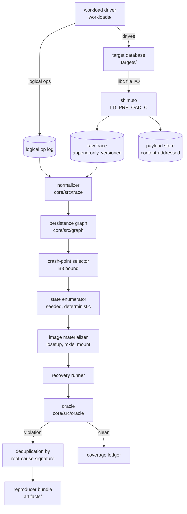

# crashfuzz — Execution Plan

Companion document to `CLAUDE.md`. `CLAUDE.md` defines scope and acceptance criteria;
this document defines the implementation approach, ordering, and known risks.

Requirements added here that do not appear in `CLAUDE.md` are marked **[ADDED]** with a
justification. No gate defined in `CLAUDE.md` is relaxed.

---

## 1. Positioning

**Revised after Phase 0 research, 2026-08-15.** The original statement claimed ALICE "does
not scale past a few thousand operations". Pathfinder, the source that claim was attributed
to, makes only a qualitative statement and no source found supports the number, so it is
withdrawn. See `docs/journal.md`, Phase 0 entry. The current statement:

> CrashMonkey tests file systems and does not reorder I/O. ALICE tests applications and
> reorders I/O, but its target set is from 2014 and it needs a hand-written checker per
> workload. Pathfinder tests applications and scales further than both, on LevelDB, RocksDB
> and WiredTiger. crashfuzz applies ALICE's reordering model, under B3's empirical bound,
> to a storage engine none of them tested — redb — with the oracle derived mechanically from
> the engine's own written durability guarantee rather than hand-written per workload.

The Phase 0 gate requires this to survive the question "why hasn't this already been
done?". The answer is that it largely has been, and the contribution is the target and the
oracle, not the technique. The full defence is in `docs/prior-art.md`.

---

## 2. Execution environment

crashfuzz requires `LD_PRELOAD`, ext4/xfs/btrfs, and loopback block devices. macOS
provides none of these, so all runtime components execute inside a Linux VM.

```text
macOS host (arm64)                    Lima VM "crashfuzz" (Ubuntu 24.04 aarch64)
├─ editor, git, docs      ─virtiofs─▶ /Users/yungmanny/crashFuzz   (source)
└─ limactl                           ├─ /var/lib/crashfuzz/images  (sparse images, guest disk)
                                     ├─ /var/lib/crashfuzz/mnt     (mount points)
                                     ├─ /dev/loop0..N
                                     ├─ ext4 (ordered, journal), xfs, btrfs
                                     ├─ shim.so via LD_PRELOAD
                                     └─ bun, clang, matplotlib
```

Crash images are written to `/var/lib/crashfuzz` on the guest disk. virtiofs is a
pass-through protocol, not a block-backed filesystem, and does not exhibit the persistence
behavior under test, so images placed on the shared mount would produce invalid results.

Setup:

```bash
brew install lima
bun run vm:up      # limactl start --name=crashfuzz vm/lima.yaml
bun run vm:sh
```

VM provisioning verifies that ext4, xfs, and btrfs are present in `/proc/filesystems` and
fails if any is missing. Without this check, an unavailable filesystem would be skipped
silently and the Phase 4 sweep would report fewer configurations than claimed.

The host is aarch64. Ubuntu's arm64 kernel uses a 4 KiB page size, so block-granularity
assumptions from the x86 literature carry over. This is recorded as an assumption in
`docs/model.md` rather than treated as established.

---

## 3. Architecture



| Path | Language | Contents |
|---|---|---|
| `shim/` | C | `LD_PRELOAD` interposer producing `shim.so` |
| `core/src/trace/` | TypeScript | Trace format, payload store, normalizer, logical-op correlation |
| `core/src/graph/` | TypeScript | Persistence graph; one module per filesystem model |
| `core/src/enumerate/` | TypeScript | Crash-point selection, state enumeration, bounds configuration |
| `core/src/image/` | TypeScript | Image materialization and loop device lifecycle |
| `core/src/oracle/` | TypeScript | Durability contract, violation classes, root-cause signatures |
| `core/src/campaign/` | TypeScript | Sweep runner, coverage ledger, results table |
| `workloads/` | TypeScript | Workload driver and workload shapes |
| `targets/` | shell | Build recipes for the primary and control targets, pinned by commit |
| `plots/` | Python | matplotlib figure scripts and their output |
| `docs/` | Markdown | Prior art, target selection, model, coverage, findings, journal |

---

## 4. Correlating syscalls with logical operations **[ADDED]**

`CLAUDE.md` specifies syscall capture and an oracle but not the link between them. The
link does not exist implicitly and must be designed during Phase 1, since Phase 3 depends
on it.

The shim observes `pwrite(fd=7, offset=4096, length=512)`. The oracle needs to evaluate
whether `PUT("user:42", "alice")` was acknowledged as durable. The syscall stream alone
does not carry that information.

The workload driver therefore emits a logical operation log alongside the syscall trace:

```ts
type LogicalOp = {
  opId: number
  kind: 'PUT' | 'DELETE' | 'TXN_BEGIN' | 'TXN_COMMIT'
  key: string
  valueDigest: string
  ackKind: 'RETURNED' | 'DURABLE'  // DURABLE = target's durability contract satisfied
  markerSeq: number                 // position within the syscall stream
}
```

Correlation uses in-band markers rather than timestamps. Before and after each logical
operation, the driver writes a small record to a dedicated `crashfuzz.marker` file
descriptor. The shim recognizes that descriptor, records the marker inline in the trace,
and excludes it from the target's data path. This yields an exact interleaving point
without depending on wall-clock ordering across threads.

The oracle's contract becomes:

> For crash point *k*, every `LogicalOp` with `ackKind === 'DURABLE'` and
> `markerSeq < k` must be readable after the target's own recovery, with a matching
> `valueDigest`. No operation with `markerSeq > k` may have materialized in a way that
> violates the target's stated invariants.

---

## 5. Phases

Phases are sequential; a phase does not begin while a prior checkbox is unchecked. Each
ends with a commit recording state and violation counts, plus a `docs/journal.md` entry.

### Phase 0 — Prior art, positioning, target selection (~2–3 days)

Deliverables:

1. Read all five references. Two are directly available (Pillai OSDI '14; Mohan
   arXiv 1810.02904). Ferrite (ASPLOS '16), Pathfinder (2025), and Rebello on fsync errors
   need to be located first.
2. `docs/prior-art.md` — for each reference: what it does, what it does that this project
   does not, and why.
3. `docs/target-selection.md` — primary target, control target (SQLite, per `CLAUDE.md`),
   and at least three rejected candidates with reasons.

Candidate pool for evaluation. `CLAUDE.md` requires these be evaluated rather than assumed:

| Candidate | Language | Relevant property | Selection risk |
|---|---|---|---|
| redb | Rust | Documented ACID and durability semantics; post-ALICE | Small user base weakens the "real users" criterion |
| fjall | Rust | Active LSM engine | May be too young for a credible report |
| bbolt | Go | Used by etcd; explicit fsync discipline | Go interception constraint (§7.1); well-studied |
| BadgerDB | Go | Explicit `SyncWrites` semantics | Go interception constraint (§7.1) |
| DuckDB | C++ | Documented WAL and durability claims; active | Size conflicts with criterion 3 |
| LMDB | C | Clean design, strong claims | mmap-based writes are unobservable to the shim (§7.2) |
| RocksDB | C++ | Widely deployed | Large; extensive existing test investment |
| LevelDB | C++ | — | Rejected: covered by ALICE's 2014 set (criterion 2) |
| SQLite | C | — | Control only, per `CLAUDE.md` |

**[ADDED] Sixth selection criterion: interception compatibility.** See §7.1. A target that
issues syscalls without going through libc cannot be observed by an `LD_PRELOAD` shim.
This must be verified before a target is committed to, not discovered during Phase 1.

Exit criteria (all met 2026-08-15):

- [x] `docs/prior-art.md` covers all five references with the differentiation statement
- [x] Positioning statement written and defensible
- [x] `docs/target-selection.md` names primary, control, and at least three rejections
- [x] **[ADDED]** Primary target's syscall path verified: `strace -f -c` shows the calls,
      and an `LD_PRELOAD` probe observes the same calls
- [x] Maintainer activity in the last 90 days recorded with links

Commit: `phase0: prior art, positioning, target=redb control=sqlite`

---

### Phase 1 — Trace capture (~5–7 days)

Record the target's file I/O. No crash simulation in this phase.

Interception mechanism comparison, to be recorded in the journal per `CLAUDE.md`:

| | `LD_PRELOAD` | `ptrace` / `strace` | eBPF |
|---|---|---|---|
| Per-call overhead | nanoseconds | 10–100 µs | low |
| Payload capture | direct (buffer in scope) | requires `process_vm_readv` | ring buffer |
| Observes raw `syscall()` | no | yes | yes |
| Observes Go runtime I/O | no | yes | yes |
| Observes static binaries | no | yes | yes |
| Within "userspace only" non-goal | yes | yes | ambiguous |

Plan: implement `LD_PRELOAD` as the primary mechanism and retain a `strace -ff -yy`
ingestion path as a fallback. Which one is load-bearing depends on the Phase 0 target
choice. eBPF is recorded as evaluated and rejected against the `CLAUDE.md` non-goal
boundary.

Intercepted calls: `write`, `pwrite`, `pwrite64`, `writev`, `pwritev`, `fsync`,
`fdatasync`, `sync_file_range`, `rename`, `renameat`, `renameat2`, `link`, `linkat`,
`unlink`, `unlinkat`, `truncate`, `ftruncate`, `open`/`openat` (including `O_TRUNC`,
`O_APPEND`, `O_TMPFILE`, `O_DIRECT`, `O_DSYNC`), `mkdir`, `close`, `msync`, `fallocate`.

`renameat2` and the `O_TMPFILE` + `linkat` pair are included because current storage
engines use them to implement atomic update protocols, which is the code path this project
targets.

Recorded per event: file descriptor, resolved path, offset, length, payload digest,
ordering index, thread id, return value, wall time, errno. Paths are resolved at `open`
and cached per descriptor, since resolving at write time is subject to races with
concurrent renames.

Trace format v1: versioned header, append-only records, payloads stored out-of-line in a
content-addressed store (`blake3` digest → `artifacts/<run>/cas/<hex>`). The trace is
replayable without the target present. Content addressing keeps trace size bounded when a
workload rewrites the same page repeatedly.

Implementation concerns:

1. **Reentrancy.** The shim's own trace writes pass through the intercepted `write()`,
   causing unbounded recursion. Resolved with a thread-local guard and by emitting trace
   bytes through `syscall(SYS_write, …)` directly.
2. **Initialization order.** `dlsym(RTLD_NEXT, "write")` may allocate on first call. If the
   target performs I/O before the shim's constructor completes, this deadlocks. Resolved
   with a static bootstrap allocator used until `dlsym` resolves.
3. **fork and exec.** Child processes inherit `LD_PRELOAD`. Per-pid trace segments are
   merged on a shared ordering index held in a `MAP_SHARED` counter page.
4. **Thread ordering.** The ordering index is taken from a global atomic `fetch_add`
   immediately before the underlying call, and a second index is recorded on return, so
   both submission and completion order are preserved. Per-thread lock-free ring buffers
   are drained by a background writer. The hot path performs no allocation and takes no
   locks, which is what the "without deadlocking" completion condition requires.
5. **Memory-mapped writes.** Stores to a `MAP_SHARED` region are not visible to the shim
   until `msync`. Targets that write through mmap have an unobservable window. This is
   recorded in `docs/coverage.md` when encountered.

Exit criteria (from `CLAUDE.md`; all met 2026-08-15, evidence in `docs/journal.md`):

- [x] A hand-written workload's trace matches a manually derived expected sequence exactly
- [x] The target's own test suite passes under interception
- [x] Multithreaded capture preserves a total order without deadlocking
- [x] A 10,000-operation workload is traced in under 60 s, with size reported
- [x] Payload storage is content-addressed

Format specification: `docs/trace-format.md`.

Commit: `phase1: trace capture, 14 call names intercepted, 10k ops in 0.4s / 2.5MB`

---

### Phase 2 — Crash state enumeration (~5–7 days)

Convert one trace into the set of legal post-crash disk images.

**Persistence graph.** Nodes are operations; edges are happens-before-for-persistence
relationships implied by `docs/model.md`. Edge types:

| Edge | Meaning |
|---|---|
| `DURABILITY_FLOOR` | Everything preceding a returned `fsync(fd)` on that file must be present |
| `METADATA_ATOMIC` | `rename`, `link`, `unlink` apply atomically |
| `DATA_BEFORE_METADATA` | Data reaches disk before dependent metadata (ext4 `data=ordered`) |
| `SAME_BLOCK_ORDER` | Overlapping writes to one block cannot be reordered |
| `DIR_ENTRY_DEPENDENCY` | A directory entry cannot appear before its inode exists |

Each edge cites Pillai et al. Each filesystem model is a separate module that enables or
disables edges; ext4 `data=ordered` and `data=journal` differ only in
`DATA_BEFORE_METADATA`.

**Bounding the state space.** At a crash point with *u* unpersisted operations, the
unconstrained state set has 2^*u* members, so the space must be bounded. Each bound is a
configuration value carrying its justification:

```jsonc
{
  // Mohan et al. (OSDI '18) report that every bug in their corpus involves a
  // crash following an fsync-family call. Other crash points receive a
  // stratified sample rather than exhaustive coverage.
  "crashPoints": "fsyncAdjacent+sample",
  "nonFsyncSampleRate": 0.05,

  // Caps the per-crash-point state set at 2^8 = 256.
  "maxUnpersistedWindow": 8,

  // Mohan et al.: most known bugs reproduce within three operations.
  // Exhaustive within this bound, sampled beyond it.
  "maxExhaustiveWorkloadOps": 3,

  // Torn writes modeled as prefix-or-nothing at sector granularity rather
  // than over the full byte-range powerset. Granularity is justified in
  // docs/model.md.
  "tornWriteModes": ["none", "sectorPrefix"],
  "tornWriteGranularityBytes": 512
}
```

With *u* bounded, the number of states per crash point is constant, so total states grow
linearly in trace length. This is what the mandated state-count plot verifies; if growth
is not roughly polynomial, the bounds are incorrect.

**Hand-computed count test.** `core/tests/unit/state-count.test.ts` contains this table,
as the completion condition requires:

| Trace | Crash point | Unconstrained ops | States |
|---|---|---|---|
| `write(A); write(B); fsync(fileA)` | after op 1 | A | 2 |
| | after op 2 | A, B | 4 |
| | after op 3 | B (A pinned by durability floor) | 2 |
| | | **total** | **8** |

**Materialization.** Create a sparse base image, run `mkfs.<fs>`, attach with `losetup`,
mount, apply the selected subset of effects, unmount, detach, and snapshot. Attach and
detach are wrapped in a lifecycle guard with teardown on abort so that an interrupted run
does not leave loop devices bound.

Exit criteria:

- [ ] Enumeration is deterministic and seed-reproducible
- [ ] The synthetic 3-operation trace produces exactly the hand-computed count, with the
      computation shown in the test file
- [ ] State count versus trace length is measured and plotted, and is roughly polynomial
- [ ] The positive control (write then rename without fsync) is flagged
- [ ] The negative control (correctly fsynced) is not flagged

Commit: `phase2: enumeration, <N> states from <M>-op trace, controls pass`

---

### Phase 3 — Recovery and the oracle (~5–7 days)

`CLAUDE.md` identifies the oracle as the weakest component. Where a behavior's legality is
uncertain, the default conclusion is that the model is wrong.

Loop: point the target at each crash image, allow it to run its own recovery, query it,
and compare against the logical operation log's durability expectations at that crash
point.

Violation classes:

| Class | Meaning |
|---|---|
| `LOST_ACKED` | An operation acknowledged durable before the crash point is missing after recovery |
| `PHANTOM_UNACKED` | An operation never acknowledged materialized in a way that breaks a stated invariant |
| `CORRUPT_INVARIANT` | Recovery completed but the store's own consistency check fails |
| `RECOVERY_FAILED` | The target refuses to open, hangs, or crashes on a legal image |

Deduplication uses a root-cause signature rather than a message string:

```text
signature = H(crashPointOpKind, violationClass, firstDivergentLogicalOpKind,
              normalize(violatedEdgeSet))
```

**Control target configuration.** SQLite's durability guarantees depend on its settings.
`PRAGMA synchronous=NORMAL` in WAL mode is documented to allow loss of recently committed
transactions after a power failure. Running the control in that configuration would
produce violations that are correct behavior, and the zero-violations gate would fail for
reasons unrelated to the oracle. `journal_mode` and `synchronous` are therefore pinned
explicitly in `docs/model.md`, and this case is recorded under known-legal weirdness.

Exit criteria:

- [ ] The SQLite control reports zero violations across the full bounded space. If not, the
      oracle is incorrect and is fixed; the finding is not reported.
- [ ] Every violation reproduces on a clean machine from the artifact alone
- [ ] Violations are deduplicated by root-cause signature
- [ ] `docs/model.md` has a known-legal weirdness section with at least one real entry

Commit: `phase3: oracle live, control clean over <N> states, <V> candidate violations`

---

### Phase 4 — Campaign (~4–6 days, largely compute-bound)

Sweep matrix:

| Axis | Values |
|---|---|
| Filesystem | ext4 `data=ordered`, ext4 `data=journal`, xfs, btrfs |
| Workload shape | single-writer, concurrent writers, large values (above block and page size), many small transactions, rename-based update protocol |
| Target | primary, control |

The results table is generated from run data rather than written by hand.

Coverage is measured by building the target with coverage instrumentation
(`--coverage` or `-fprofile-instr-generate`) and reporting which write-path functions were
exercised. `docs/coverage.md` states what was not tested, including the mmap window from
Phase 1, any filesystem that was unavailable, and any workload shape not run.

Exit criteria:

- [ ] At least 10,000 crash states tested on the primary target
- [ ] Results table by filesystem, mount option, and workload shape
- [ ] `docs/coverage.md` states what was not tested and why
- [ ] Every candidate triaged as real bug, model incorrect, or undecided. Undecided is a
      permitted outcome.

Commit: `phase4: campaign, <N> states across <F> filesystems, <R> real / <M> model / <U> undecided`

---

### Phase 5 — Disclosure (~1–3 days, plus maintainer response time)

Applies only to violations surviving Phase 4 triage.

Before filing, write the maintainer's strongest rebuttal in `docs/journal.md` — assume the
first reply is "that is expected behavior, read the docs" — and answer it. If the answer is
weak, do not file. `CLAUDE.md` treats an incorrectly filed report as unrecoverable.

Clean-machine verification uses a fresh `limactl start --name=crashfuzz-verify` from the
same configuration and a fresh clone, not the development VM.

Exit criteria:

- [ ] The reproducer runs from a fresh clone with one command
- [ ] The report states the guarantee (quoted from the target's documentation), the
      workload, the crash point, the expected state, the observed state, and the environment
- [ ] The report does not speculate about internals or propose a fix unless asked
- [ ] Filed, with the thread linked in the README regardless of outcome

---

### Phase 6 — Write-up (~2–3 days)

- [ ] `README.md`: what the tool does, how to run it, results table, limitations
- [ ] `docs/findings.md`: bugs found, or what was verified clean and what that verification
      establishes
- [ ] Architecture diagram covering trace → graph → state → oracle
- [ ] Failure log with at least three approaches that did not work
- [ ] A reader unfamiliar with the project can reproduce the headline result from the
      README alone

---

## 6. Model decisions requiring written comparison

`CLAUDE.md` requires two readings of the persistence semantics to be argued in
`docs/journal.md` before implementing anything that touches the correctness model, with
the rejected argument recorded. Open questions, ordered by what they block:

| # | Question | Reading A | Reading B | Blocks |
|---|---|---|---|---|
| 1 | Is `rename` ordered after unfsynced writes to the renamed file? | ext4 `data=ordered` provides this in practice, so model it | Not guaranteed by POSIX, xfs, or btrfs; modeling it would hide real bugs | Phase 2 graph |
| 2 | Torn-write granularity | 512 B, matching device sector atomicity | 4 KiB, matching page cache writeback | Phase 2 bounds |
| 3 | Does `fsync(fd)` imply the directory entry is durable? | No; `fsync(dirfd)` is required (an ALICE finding) | Yes on some filesystems; assuming no would produce false positives | Phase 2, oracle |
| 4 | Default ext4 mode | `data=ordered`, the common default | `data=journal`, a stronger and simpler model | Phase 2 config |
| 5 | Is unacknowledged data that reaches disk a violation? | Yes, if it breaks a stated invariant | No; unacknowledged data is unconstrained | Oracle |
| 6 | Does `RECOVERY_FAILED` on a legal image count as a bug? | Yes; refusing to open a legal state loses data | No; refusing to open is failing safe | Phase 3 triage |

---

## 7. Risks

### 7.1 Go and statically linked targets cannot be observed via `LD_PRELOAD`

The Go runtime issues syscalls directly on Linux rather than calling libc, so an
`LD_PRELOAD` interposer observes no file I/O from a Go binary. The same applies to
statically linked binaries.

If Phase 0 selects bbolt, BadgerDB, or Pebble, Phase 1's primary mechanism must be
`ptrace`-based, which is a different and substantially slower implementation. Rust
(`std::fs` calls libc), C, and C++ targets are unaffected.

Mitigation: the added Phase 0 exit criterion verifies the syscall path empirically before
the target is committed to.

### 7.2 Remaining risks

| # | Risk | Severity | Mitigation |
|---|---|---|---|
| 2 | An incorrect oracle produces a false positive that gets filed | Critical | Control-clean gate; adversarial self-review in Phase 5; default conclusion is that the model is wrong |
| 3 | State explosion | High | Bounds configuration with inline justification; polynomial-growth plot as the check |
| 4 | Leaked loop devices, or operating on a real filesystem | High | Lifecycle guard with teardown on abort; images confined to `/var/lib/crashfuzz`; VM-only execution |
| 5 | Memory-mapped writes are unobservable | Medium | Recorded in `docs/coverage.md`; may disqualify LMDB as the primary target |
| 6 | xfs or btrfs semantics differ enough that legal behavior appears as a violation | Medium | Per-filesystem model modules; findings recorded under known-legal weirdness |
| 7 | The shim perturbs the target enough to change its behavior | Medium | The target's own test suite must pass under interception (Phase 1 gate) |
| 8 | Target too large to instrument and reason about within the time budget | Medium | Criterion 3 in Phase 0; DuckDB and RocksDB are the candidates at risk |
| 9 | No bugs found | Expected outcome | Reported as a partial result per `CLAUDE.md`, stating what was verified and what that establishes |

---

## 8. Schedule

| Phase | Days | Cumulative |
|---|---|---|
| 0 — Prior art and target selection | 2–3 | 3 |
| 1 — Trace capture | 5–7 | 10 |
| 2 — Enumeration | 5–7 | 17 |
| 3 — Oracle | 5–7 | 24 |
| 4 — Campaign | 4–6 | 30 |
| 5 — Disclosure | 1–3, plus maintainer response time | 33 |
| 6 — Write-up | 2–3 | 36 |

Approximately four to six weeks of working days. Phase 5's response time is outside the
project's control; the README links the thread regardless of outcome.

---

## 9. Process

Phases are managed with GSD:

```text
gsd-new-project            # once, seeded from CLAUDE.md and this plan
gsd-plan-phase <n>         # per phase, before implementation
gsd-execute-phase <n>      # atomic commits
gsd-verify-work <n>        # goal-backward check against the exit criteria
pr-review-toolkit          # before each phase commit
```

`tdd-guard` is enabled in `.claude/settings.json`. The enumeration and oracle components
are where incorrect results are hardest to detect, and Phase 2's hand-computed count is a
test-first requirement stated in `CLAUDE.md`.

Each phase ends with a `docs/journal.md` entry recording what was tried, what failed, and
what was learned. The journal is the source material for the write-up.
